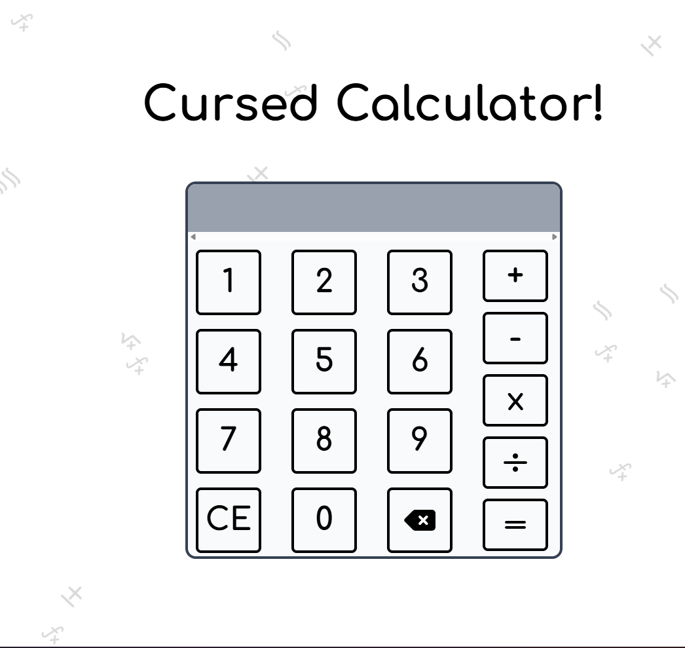

<h1 style="text-align:center;"> Goofy-Calculator By <a href="https://github.com/hazorox">Hazoro</a>
</h1>

 Live at : <a href="https://goofy-calculator.netlify.app">goofy-calculator.netlify.app</a>

Your Basic Average Calculator _wink wink_, but doesn't let you finish a single calculation without the cursed SFXs.
Why are they cursed? Coz they're just goofy.

Why to use it over your average calculator ? Uhhh idk just some project I wanted to try :P.

1. 67! SFX Indicator
2. FN buttons SFXs
3. Certain Calculations SFx indicators

A simple   project by Hazorox

